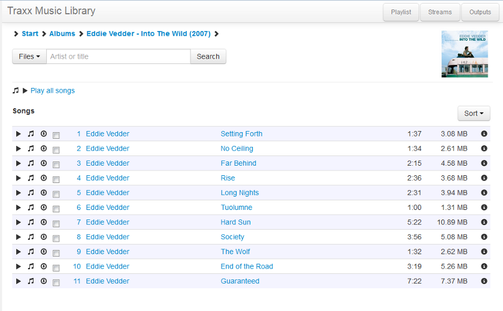

Traxx-web
=========

This is the web front-end of Traxx. It is a web-based client for [MPD](http://mpd.wikia.com/),
that uses an external database for keeping song information.

It was inspired by [Zina](http://www.pancake.org/zina), but has some different goals and some different
design fundamentals. Zina has many features that may some day make it into
Traxx, but for now, it does the following:

* Let you browse the library; display (sub)directories and songs separately
* Search the database, incrementally display the results (no button click required)
* Manage the MPD playlist: add/remove/move songs, clear/cleanup playlist
* Manage MPD: play, pause, stop, skip
* Display song information (selected attributes from the database)
* Transparently manage MPD's internal music database
* Add external streams from a pre-configured set to the MPD playlist
* Disable/enable MPD outputs
* Works great on desktop and tablet browsers, maybe even on smartphones

Traxx is based on the following principal ideas:

* The external database (for example, in MySQL) is the only source of
  information about the music collection.
* Database maintenance can/should be done with 'mindexd'. The web application
	does not access your music collection directly, except for finding _folder.jpg_ images.
* When a song is added to the playlist, it is transparently added to MPD's
  internal database, by creating a symbolic link to the song in MPD's music directory.
* All text-data is encoded in unicode/UTF-8.

This web front-end is written in Python (developed and tested with 2.7), using
the [Flask microframework](http://flask.pocoo.org/). At the front, it uses Twitter Bootstrap and
jQuery. The interface makes heavy use of AJAX, but at the same time maintains
the ability to bookmark the content you are viewing and use the back and
forward buttons of your browser to navigate.

The prerequisites for using this software are:
* A working MPD server, not necessarily on the same host (Debian: mpd)
* A webserver capable of serving WSGI applications
* Flask (&gt;= 0.9, untested with 0.8) and its dependencies (like Werkzeug &amp; Jinja2)
* [Python-mpd v0.3](https://pypi.python.org/pypi/python-mpd/), the MPD client library for Python (Debian: python-mpd)
* [SQLAlchemy](http://www.sqlalchemy.org/) (&gt;= 0.7) (Debian: python-sqlalchemy)

Other third-party components are shipped with the application:
* [Twitter Bootstrap v2.3.0](http://twitter.github.com/bootstrap/)
* [jQuery v1.9.1](http://jquery.com/)
* [jQuery PJAX](https://github.com/defunkt/jquery-pjax) for HTML5 pushState handling
* [Bootstrapx Clickover](https://github.com/lecar-red/bootstrapx-clickover), Bootstrap extension for click managed popovers

Installation
============

* Install the prerequisites in a <i>virtualenv</i>

	```bash
	apt-get install python-virtualenv python-dev libmysqlclient-dev
	cd ~/www
	virtualenv venv
	cd venv
	source bin/activate
	pip install sqlalchemy mysql-python mutagen daemon pyinotify
	pip install flask python-mpd2
	git clone https://github.com/tinuzz/traxx.git
	```

* Edit `traxx/web/traxx/traxx.conf`
* Start the server locally:

	`python traxx/web/traxx/__init__.py`

Screenshots
===========


